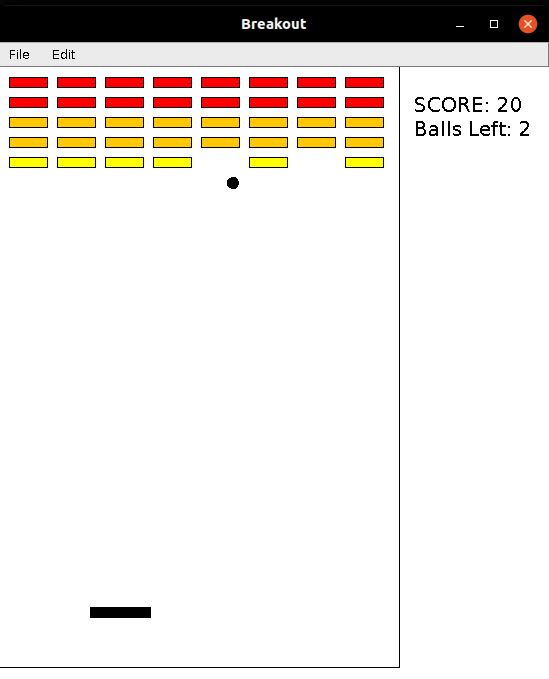

Breakout
-
A desktop game implemented in Java using acm library provided by Stanford University in the Course [**CS106a: Programming Methodology**]([I'm an inline-style link](https://www.google.com))

